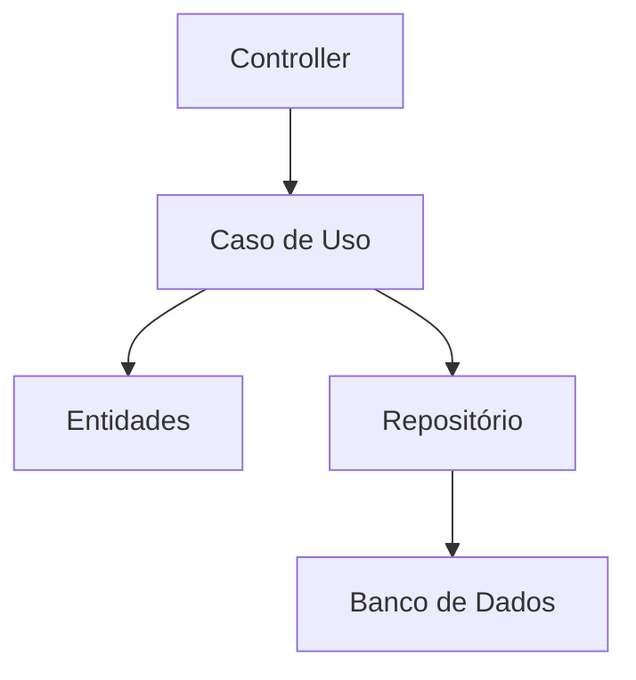

# Clean Architecture (Arquitetura Limpa) 🧹

A **Clean Architecture**, ou Arquitetura Limpa, é um padrão arquitetural proposto por Robert C. Martin (Uncle Bob) que foca em manter a lógica de negócio independente de frameworks, bancos de dados, interfaces de usuário e outros detalhes externos. 

A ideia central é organizar o código em **camadas concêntricas**, com o núcleo contendo a lógica de negócio e as camadas externas lidando com os detalhes de implementação.

---

## Como funciona a Clean Architecture? 🌐

Na Arquitetura Limpa, o código é organizado em camadas concêntricas, cada uma com responsabilidades específicas. A regra mais importante é que **dependências sempre apontam para dentro**, ou seja, camadas externas podem depender das internas, mas nunca o contrário.

### Diagrama Contextual 📊

```mermaid
graph TD
    ENTITIES[Entidades (Entities)]
    USE_CASES[Casos de Uso (Use Cases)]
    INTERFACE[Interface de Controle (Controllers)]
    INFRA[Infraestrutura (DB, APIs, Frameworks)]

    ENTITIES --> USE_CASES
    USE_CASES --> INTERFACE
    INTERFACE --> INFRA
```

1. **Entidades (Entities):** Contêm as regras de negócio mais gerais e independentes.
2. **Casos de Uso (Use Cases):** Implementam a lógica específica de cada operação do sistema.
3. **Interface de Controle:** Responsável por receber requisições, chamar os casos de uso e retornar respostas.
4. **Infraestrutura:** Gerencia detalhes técnicos como bancos de dados, APIs ou frameworks.

---

## Vantagens e Desvantagens da Clean Architecture

### Vantagens 🌟

1. **Independência de Tecnologias:**
   - A lógica de negócio não depende de frameworks ou bancos de dados.
   - Facilita mudanças de ferramentas externas.

2. **Testabilidade:**
   - O núcleo pode ser testado isoladamente, sem necessidade de componentes externos.

3. **Manutenção e Escalabilidade:**
   - Código organizado em camadas torna o sistema mais fácil de entender e expandir.

4. **Alta Coesão e Baixo Acoplamento:**
   - As camadas têm responsabilidades bem definidas, reduzindo dependências.

### Desvantagens ❌

1. **Complexidade Inicial:**
   - Exige um planejamento mais detalhado e um esforço inicial maior.

2. **Curva de Aprendizado:**
   - Pode ser desafiador para equipes novas no padrão.

3. **Overhead em Projetos Simples:**
   - Para sistemas pequenos, a divisão em camadas pode ser desnecessária.

---

## Exemplo Prático com Node.js 🌐

### Diagrama de Comunicação



### Código Exemplo

#### Entidades

```javascript
// product.js
class Product {
  constructor(id, name, price) {
    this.id = id;
    this.name = name;
    this.price = price;
  }

  validate() {
    if (!this.name || this.price <= 0) {
      throw new Error('Produto inválido!');
    }
  }
}

module.exports = Product;
```

#### Casos de Uso

```javascript
// createProductUseCase.js
class CreateProductUseCase {
  constructor(productRepository) {
    this.productRepository = productRepository;
  }

  async execute(productData) {
    const product = new Product(null, productData.name, productData.price);
    product.validate();
    return await this.productRepository.save(product);
  }
}

module.exports = CreateProductUseCase;
```

#### Interface de Controle

```javascript
// productController.js
class ProductController {
  constructor(createProductUseCase) {
    this.createProductUseCase = createProductUseCase;
  }

  async handleCreateProduct(req, res) {
    try {
      const product = await this.createProductUseCase.execute(req.body);
      res.status(201).json(product);
    } catch (error) {
      res.status(400).json({ error: error.message });
    }
  }
}

module.exports = ProductController;
```

#### Repositório e Infraestrutura

```javascript
// productRepository.js
class ProductRepository {
  constructor(database) {
    this.database = database;
  }

  async save(product) {
    const result = await this.database.query('INSERT INTO products SET ?', product);
    return { id: result.insertId, ...product };
  }
}

module.exports = ProductRepository;
```

#### Inicialização do Sistema

```javascript
// app.js
const express = require('express');
const bodyParser = require('body-parser');
const database = require('./database'); // Simulação de conexão com DB
const ProductRepository = require('./productRepository');
const CreateProductUseCase = require('./createProductUseCase');
const ProductController = require('./productController');

const app = express();
app.use(bodyParser.json());

// Inicializando os componentes
const productRepository = new ProductRepository(database);
const createProductUseCase = new CreateProductUseCase(productRepository);
const productController = new ProductController(createProductUseCase);

// Rotas
app.post('/products', (req, res) => productController.handleCreateProduct(req, res));

// Iniciando o servidor
app.listen(3000, () => {
  console.log('Servidor rodando na porta 3000');
});
```

---

## Boas Práticas e Cuidados a Tomar 🛠️

### Boas Práticas
1. **Mantenha a Regra de Dependências:**
   - Camadas externas não devem influenciar o núcleo.
2. **Defina Interfaces Claras:**
   - Utilize contratos para a comunicação entre camadas.
3. **Teste o Núcleo Separadamente:**
   - Foco em testar casos de uso e entidades.

### Cuidados
1. **Evite Misturar Responsabilidades:**
   - Não insira lógica de negócio nos controladores ou detalhes de banco no núcleo.
2. **Adapte-se ao Escopo do Projeto:**
   - Use a Clean Architecture em sistemas que realmente se beneficiam de seu rigor.

---

## Conclusão 🎯

A Clean Architecture é um padrão poderoso para sistemas que precisam de alta manutenção, flexibilidade e independência tecnológica. Apesar de sua complexidade inicial, oferece benefícios claros para equipes que buscam um código sustentável e escalável. Adote com sabedoria, e veja seu sistema se tornar mais organizado e robusto! 🚀
