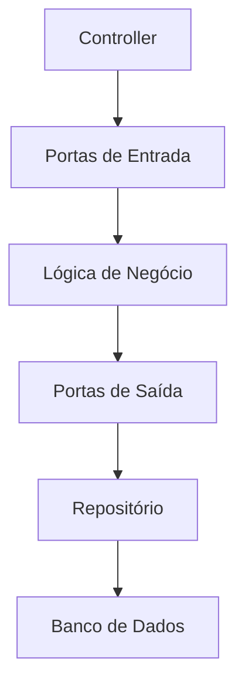

# Hexagonal Architecture (Arquitetura Hexagonal) ⛔️

A **Hexagonal Architecture**, ou Arquitetura Hexagonal, também conhecida como **Ports and Adapters**, é um padrão arquitetural que promove a independência da lógica de negócio em relação aos detalhes externos, como frameworks, bancos de dados ou APIs. 

A ideia principal é que o sistema central (núcleo ou domínio) não depende de detalhes externos, e sim, esses detalhes se conectam ao núcleo por meio de portas e adaptadores.

---

## Como funciona a Arquitetura Hexagonal? 🌐

A lógica de negócio (core) fica no centro do sistema, com uma interface clara para comunicação com o mundo externo. Os detalhes de implementação, como bancos de dados ou interfaces de usuário, são desacoplados e conectados por adaptadores.

### Diagrama Contextual 📊

```mermaid
graph TD
    CORE[Domínio (Core)]
    PORTS[Portas (Interfaces)]
    UI[Interface de Usuário]
    DB[Banco de Dados]
    API[APIs Externas]
    EVENTS[Eventos]

    CORE --> PORTS
    PORTS --> UI
    PORTS --> DB
    PORTS --> API
    PORTS --> EVENTS
```

A lógica de negócio define as interfaces (ports), enquanto adaptadores externos implementam essas interfaces para conectar o núcleo a sistemas externos.

---

## Componentes da Arquitetura Hexagonal 🧩

1. **Núcleo do Domínio (Core):**
   - Contém toda a lógica de negócio e regras do sistema.
   - Define contratos (ports) para interação externa.
   - É completamente independente de tecnologias específicas.

2. **Portas (Ports):**
   - São as interfaces ou contratos que definem como o núcleo interage com o mundo externo.
   - Podem ser **entradas** (e.g., comandos do usuário) ou **saídas** (e.g., salvar dados).

3. **Adaptadores (Adapters):**
   - Implementam as portas, conectando o núcleo a detalhes externos como bancos de dados, interfaces gráficas ou APIs.
   - Existem adaptadores de entrada (e.g., APIs REST) e saída (e.g., repositórios).

---

## Vantagens e Desvantagens da Arquitetura Hexagonal

### Vantagens 🌟

1. **Desacoplamento:**
   - O núcleo não depende de detalhes de implementação, facilitando mudanças.
   - É possível trocar bancos de dados, frameworks ou até interfaces de usuário sem alterar a lógica de negócio.

2. **Testabilidade:**
   - Testes podem ser focados apenas no núcleo, simulando portas e adaptadores.

3. **Flexibilidade:**
   - Fácil de integrar novos sistemas, como APIs ou eventos.

4. **Simplicidade para domínios complexos:**
   - Ideal para sistemas com regras de negócio extensivas.

### Desvantagens ❌

1. **Complexidade Inicial:**
   - Exige esforço extra para configurar e implementar portas e adaptadores.

2. **Sobrecarga para Sistemas Simples:**
   - Para projetos pequenos, o padrão pode parecer excessivamente robusto.

3. **Curva de Aprendizado:**
   - Pode ser desafiador para equipes sem experiência em arquitetura.

---

## Exemplo Prático com Node.js 🌐

Neste exemplo, implementaremos uma aplicação simples de gerenciamento de pedidos com Arquitetura Hexagonal.

### Diagrama de Comunicação no Backend



### Código Exemplo

#### Núcleo do Domínio (Core)

```javascript
// orderService.js
class OrderService {
  constructor(orderRepository) {
    this.orderRepository = orderRepository;
  }

  async createOrder(orderDetails) {
    if (!orderDetails.productId || !orderDetails.quantity) {
      throw new Error('Dados do pedido incompletos');
    }
    return await this.orderRepository.saveOrder(orderDetails);
  }

  async getOrderById(orderId) {
    const order = await this.orderRepository.findOrderById(orderId);
    if (!order) {
      throw new Error('Pedido não encontrado');
    }
    return order;
  }
}

module.exports = OrderService;
```

#### Portas de Entrada (Interface para a Lógica de Negócio)

```javascript
// orderController.js
class OrderController {
  constructor(orderService) {
    this.orderService = orderService;
  }

  async handleCreateOrder(req, res) {
    try {
      const order = await this.orderService.createOrder(req.body);
      res.status(201).json(order);
    } catch (error) {
      res.status(400).json({ error: error.message });
    }
  }

  async handleGetOrder(req, res) {
    try {
      const order = await this.orderService.getOrderById(req.params.id);
      res.status(200).json(order);
    } catch (error) {
      res.status(404).json({ error: error.message });
    }
  }
}

module.exports = OrderController;
```

#### Portas de Saída e Adaptadores (Repositório e Banco de Dados)

```javascript
// orderRepository.js
class OrderRepository {
  constructor(database) {
    this.database = database;
  }

  async saveOrder(orderDetails) {
    const result = await this.database.query('INSERT INTO orders SET ?', orderDetails);
    return { id: result.insertId, ...orderDetails };
  }

  async findOrderById(orderId) {
    const result = await this.database.query('SELECT * FROM orders WHERE id = ?', [orderId]);
    return result[0] || null;
  }
}

module.exports = OrderRepository;
```

#### Inicialização do Sistema

```javascript
// app.js
const express = require('express');
const bodyParser = require('body-parser');
const database = require('./database'); // Simulação de conexão com DB
const OrderRepository = require('./orderRepository');
const OrderService = require('./orderService');
const OrderController = require('./orderController');

const app = express();
app.use(bodyParser.json());

// Inicializando os componentes
const orderRepository = new OrderRepository(database);
const orderService = new OrderService(orderRepository);
const orderController = new OrderController(orderService);

// Rotas
app.post('/orders', (req, res) => orderController.handleCreateOrder(req, res));
app.get('/orders/:id', (req, res) => orderController.handleGetOrder(req, res));

// Iniciando o servidor
app.listen(3000, () => {
  console.log('Servidor rodando na porta 3000');
});
```

---

## Boas Práticas e Cuidados a Tomar 🛠️

### Boas Práticas
1. **Interfaces Claras:**
   - Defina contratos explícitos entre portas e adaptadores.
2. **Independência do Core:**
   - Evite vazamentos de dependências externas para dentro da lógica de negócio.
3. **Testabilidade:**
   - Utilize testes unitários e mocks para testar portas e adaptadores.

### Cuidados
1. **Complexidade Inicial:**
   - Estime bem o custo inicial de implementação para sistemas menores.
2. **Adaptação de Equipes:**
   - Certifique-se de que a equipe esteja treinada no padrão antes de adotá-lo.

---

## Conclusão 🎯

A Arquitetura Hexagonal é um padrão poderoso para sistemas que precisam de flexibilidade, testabilidade e independência tecnológica. Apesar de exigir um esforço inicial maior, ela oferece benefícios claros em termos de manutenção e escalabilidade. Adote com cuidado, mas saiba que, quando bem aplicada, ela pode transformar a forma como você constrói sistemas! 🚀
