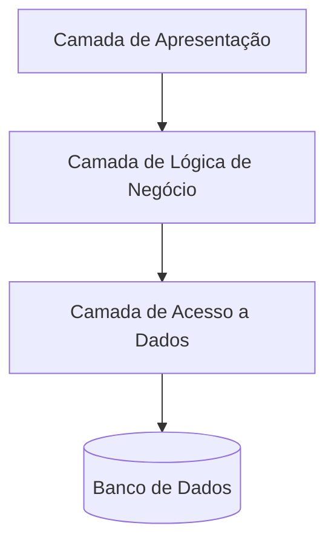
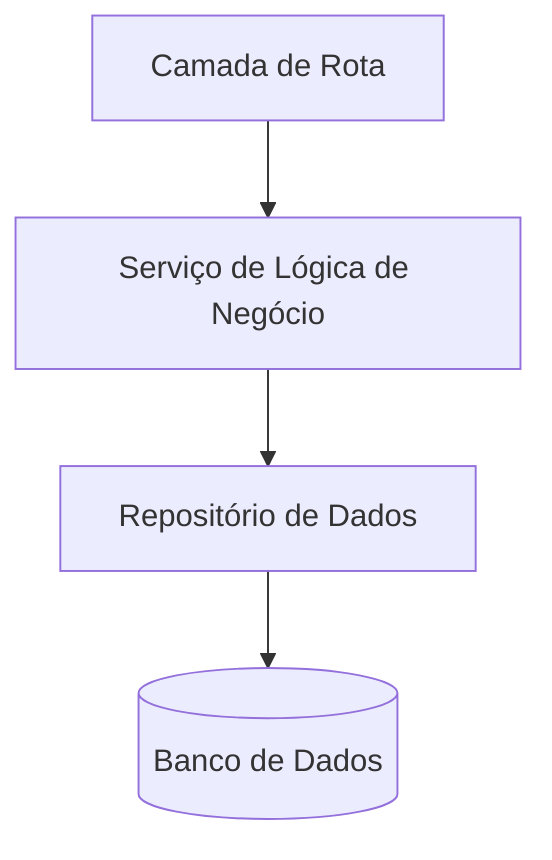

# Layered Architecture (Arquitetura em Camadas) ⛗️

A **Layered Architecture**, ou Arquitetura em Camadas, é uma das abordagens mais utilizadas para organizar sistemas de software. A ideia é simples: dividir o sistema em **camadas**, cada uma com sua responsabilidade bem definida, e controlar como elas interagem.

Imagine isso como um hambúrguer 🍔: cada camada tem um papel claro (pão, carne, alface) e elas trabalham juntas para criar uma experiência funcional e organizada.

---

## Como funciona a arquitetura em camadas? 🌐

A ideia é separar as "preocupações" (ou responsabilidades) do sistema em diferentes níveis. Cada camada tem uma função clara e **só conversa diretamente** com as camadas mais próximas. Vamos detalhar cada uma:

### Diagrama Contextual 📊

Este diagrama mostra como as camadas interagem:



A comunicação segue um fluxo hierárquico: a apresentação conversa com a lógica de negócio, que interage com o acesso a dados, que por sua vez acessa o banco.

### Camada de Apresentação (Presentation Layer) 📝

Essa é a "cara" da sua aplicação — o que o usuário vê e interage. O foco aqui é capturar as entradas do usuário e exibir os dados de forma clara e amigável. Essa camada é composta por **telas**, **componentes de interface** ou **elementos do front-end** que representam a interação com o sistema.

- **Responsabilidades principais:**

  - Renderizar os dados que vêm das camadas inferiores.
  - Capturar entradas do usuário e validar informações básicas antes de enviá-las para as camadas inferiores.
  - Exibir mensagens de erro ou de sucesso.

- **Exemplos no mundo real:**

  - Uma página da web construída com React ou Angular.
  - Um componente visual ou tela específica em um aplicativo móvel desenvolvido com Flutter ou React Native.
  - No backend, pode ser um endpoint que recebe dados HTTP e retorna respostas JSON.

> 💡 *Evite misturar responsabilidades nesta camada. No backend, não insira regras de negócio ou acessos diretos ao banco de dados; já no front-end, mantenha o foco na renderização de dados e captura de entradas.*

### Camada de Lógica de Negócio (Business Logic Layer) 🧩

Aqui é onde a "mágica" acontece. Essa é a camada responsável pelas regras e operações específicas do sistema. Ela garante que os dados estejam corretos, que os processos sigam os requisitos e que os resultados sejam coerentes.

- **Responsabilidades principais:**

  - Processar os dados recebidos da camada de apresentação.
  - Aplicar regras de negócio, como descontos, validações complexas ou autorizações.
  - Interagir com a camada de acesso a dados para buscar ou armazenar informações necessárias.

- **Exemplos no mundo real:**

  - Verificar se um usuário tem permissão para acessar determinado recurso.
  - Calcular fretes com base no peso, dimensões e localização do cliente.
  - Em um sistema backend, seria uma função ou serviço que processa pedidos e atualiza o estoque.

> ✅ *Essa camada deve ser independente de tecnologias específicas, como frameworks ou bancos de dados.*

### Camada de Acesso a Dados (Data Access Layer) 🔎

Essa camada é o "mensageiro" entre a aplicação e o mundo externo (bancos de dados, APIs, etc.). Ela existe para centralizar e organizar todas as interações externas, deixando as outras camadas menos acopladas.

- **Responsabilidades principais:**

  - Executar operações de consulta, inserção, atualização e remoção de dados.
  - Abstrair a complexidade de comunicação com APIs externas ou fontes de dados.
  - Garantir que os dados estejam no formato correto para serem utilizados pela camada de negócio.

- **Exemplos no mundo real:**

  - Um repositório em Node.js que realiza consultas SQL com uma biblioteca como Sequelize ou Knex.
  - Integração com APIs REST usando Axios ou Fetch.
  - Funções específicas para interagir com bancos de dados, como MongoDB, PostgreSQL ou Redis.

> 🔗 *Manter essa camada desacoplada facilita migrações futuras para novas tecnologias ou fontes de dados.*

---

## Exemplo no Front-end com React 🌐

### Diagrama de Comunicação no Front-end

```mermaid
graph TD
    UI[Componentes React (UI)]
    BL[Serviços de Lógica (Hooks/Contextos)]
    DAL[Cliente HTTP (Axios/Fetch)]
    API[(API Backend)]

    UI --> BL
    BL --> DAL
    DAL --> API
```

### Código Exemplo

#### Camada de Acesso a Dados (API Client)

```javascript
// taskApi.js
import axios from 'axios';

const API_BASE_URL = 'https://api.exemplo.com/tasks';

export const getTasks = async () => {
  const response = await axios.get(API_BASE_URL);
  return response.data;
};

export const createTask = async (task) => {
  const response = await axios.post(API_BASE_URL, task);
  return response.data;
};
```

#### Camada de Lógica de Negócio (Serviço)

```javascript
// taskService.js
import { getTasks, createTask } from './taskApi';

export const fetchTasks = async () => {
  const tasks = await getTasks();
  return tasks.filter((task) => !task.completed); // Retorna apenas tarefas não concluídas
};

export const addTask = async (task) => {
  if (!task.title) {
    throw new Error('O título da tarefa é obrigatório!');
  }
  return await createTask(task);
};
```

#### Camada de Apresentação (Componente React)

```javascript
// TaskList.jsx
import React, { useEffect, useState } from 'react';
import { fetchTasks, addTask } from './taskService';

const TaskList = () => {
  const [tasks, setTasks] = useState([]);
  const [newTaskTitle, setNewTaskTitle] = useState('');

  useEffect(() => {
    const loadTasks = async () => {
      try {
        const tasks = await fetchTasks();
        setTasks(tasks);
      } catch (error) {
        console.error('Erro ao carregar tarefas:', error);
      }
    };
    loadTasks();
  }, []);

  const handleAddTask = async () => {
    try {
      const newTask = await addTask({ title: newTaskTitle });
      setTasks((prevTasks) => [...prevTasks, newTask]);
      setNewTaskTitle('');
    } catch (error) {
      console.error('Erro ao adicionar tarefa:', error);
    }
  };

  return (
    <div>
      <h1>Lista de Tarefas</h1>
      <ul>
        {tasks.map((task) => (
          <li key={task.id}>{task.title}</li>
        ))}
      </ul>
      <input
        type="text"
        value={newTaskTitle}
        onChange={(e) => setNewTaskTitle(e.target.value)}
      />
      <button onClick={handleAddTask}>Adicionar Tarefa</button>
    </div>
  );
};

export default TaskList;
```

---

## Exemplo no Backend com Node.js 🌐

### Diagrama de Comunicação no Backend



### Código Exemplo

#### Camada de Acesso a Dados (Repositório)

```javascript
// userRepository.js
class UserRepository {
  constructor(database) {
    this.database = database;
  }

  async findByEmail(email) {
    const result = await this.database.query('SELECT * FROM users WHERE email = ?', [email]);
    return result[0] || null;
  }

  async save(user) {
    const result = await this.database.query('INSERT INTO users SET ?', user);
    return { id: result.insertId, ...user };
  }
}
module.exports = UserRepository;
```

#### Camada de Lógica de Negócio (Serviço)

```javascript
// userService.js
const bcrypt = require('bcrypt');

class UserService {
  constructor(userRepository) {
    this.userRepository = userRepository;
  }

  async registerUser({ name, email, password }) {
    if (!email.includes('@')) {
      throw new Error('E-mail inválido!');
    }

    const existingUser = await this.userRepository.findByEmail(email);
    if (existingUser) {
      throw new Error('Usuário já cadastrado!');
    }

    const hashedPassword = await bcrypt.hash(password, 10);
    const newUser = await this.userRepository.save({ name, email, password: hashedPassword });

    return { id: newUser.id, name: newUser.name, email: newUser.email };
  }
}
module.exports = UserService;
```

#### Camada de Apresentação (Rota)

```javascript
// userRoutes.js
const express = require('express');
const router = express.Router();
const UserRepository = require('./userRepository');
const UserService = require('./userService');
const database = require('./database');

const userRepository = new UserRepository(database);
const userService = new UserService(userRepository);

router.post('/register', async (req, res) => {
  try {
    const user = await userService.registerUser(req.body);
    res.status(201).json(user);
  } catch (error) {
    res.status(400).json({ error: error.message });
  }
});

module.exports = router;
```

---

## Boas Práticas e Cuidados a Tomar 🛠️

### Boas Práticas
1. **Separação Clara de Responsabilidades:** Certifique-se de que cada camada faça apenas o que lhe compete.
2. **Testabilidade:** Estruture as camadas para que possam ser testadas de forma independente.
3. **Abstração:** Use interfaces ou contratos claros para a comunicação entre camadas.

### Cuidados
1. **Evite Acoplamento Excessivo:** Não permita que uma camada dependa diretamente da implementação de outra.
2. **Desempenho:** Certifique-se de que o fluxo de dados entre as camadas seja eficiente, especialmente em sistemas de alta performance.
3. **Complexidade Desnecessária:** Para projetos simples, evite criar camadas demais, pois isso pode introduzir complexidade sem benefícios.

---

## Conclusão 🎯

A arquitetura em camadas é uma abordagem confiável e flexível, ideal para sistemas que priorizam organização e manutenção. Com a separação clara de responsabilidades e boas práticas, você pode construir aplicações robustas e escaláveis que atendem tanto às demandas do presente quanto às do futuro! 🚀
